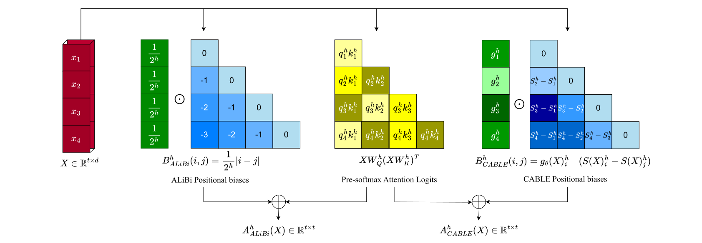
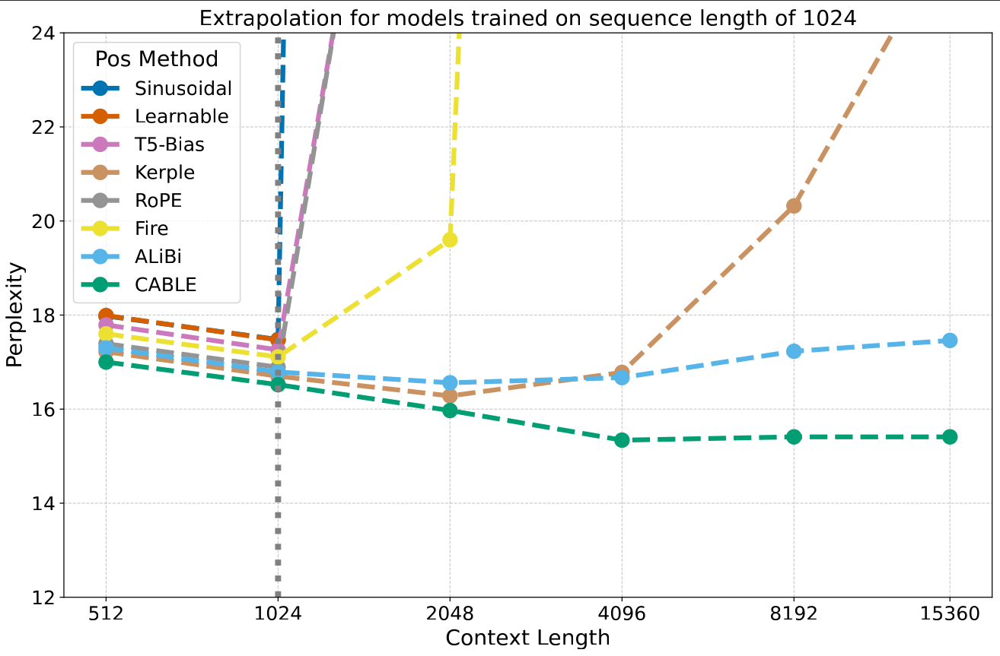
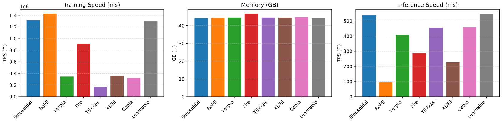

## CABLE: Context-aware Biases for Length Extrapolation 
[](https://arxiv.org/abs/2503.08067) [](https://huggingface.co/axiomlaborg/Cable)


PyTorch implementation of the paper [(Context-aware Biases for Length Extrapolation)](https://arxiv.org/abs/2503.08067). This repository is based on [Karpathy/Build-NanoGPT](https://github.com/karpathy/build-nanogpt). Thanks for their excellent work.

<p align="center">
 
</p>

Figure: Comparison of how [ALiBi](https://github.com/jaketae/alibi) and our proposed method, CABLE compute final attention scores per head. ALiBi adds
constant linear biases with head-specific slopes, fixed across tokens. CABLE adds learned, token-specific
context-aware biases and weights to the scores.

### 📦 Installation & Setup

To get started, ensure your environment includes all the required dependencies listed in `requirements.txt`. You can install them with:

```bash
pip install -r requirements.txt
```
Then, clone the repository and navigate to the project root:
```bash
git clone https://github.com/axiomlab/Cable.git 
cd Cable/
```
You're now ready to run the code and load the models.

### 🚀 Loading Our Models
You can easily download our pretrained GPT checkpoints using the huggingface_hub library. To load the model, use the following code and make sure you're running it from the root directory of the project:
```python
import torch
from huggingface_hub import hf_hub_download
import sys
sys.path.append('src')
from src.model_gpt import Model
from src.train_gpt import ModelConfig
from huggingface_hub import login


# Specify the model ID and the filename you want to download
repo_id = "axiomlaborg/GPT-Cable"
filename =  "medium_cable6_fineweb-edu-10B_1_524288_16_1024.pt"
# You can replace filename with other choices:
# filename = "small_cable6_fineweb-edu-10B_1_524288_32_1024.pt"
# filename = "tiny_cable6_fineweb-edu-10B_1_524288_64_1024.pt"

# Download our model trained checkpoint
checkpoint_path = hf_hub_download(repo_id=repo_id, filename=filename)
device = "cuda" if torch.cuda.is_available() else "mps" if torch.backends.mps.is_available() else "cpu"
pos_method = filename.split('_')[1]
trained_seq_len = int(filename.split('_')[-1].split('.')[0])

if 'tiny' in filename:
    config = ModelConfig(pos_method=pos_method, use_dape=False, vocab_size=50304, n_layer=6, n_head=8, n_embd=512, block_size=trained_seq_len)
elif 'small' in filename:
    config = ModelConfig(pos_method=pos_method, use_dape=False, vocab_size=50304, n_layer=12, n_head=12, n_embd=768, block_size=trained_seq_len)
elif 'medium' in filename:
    config = ModelConfig(pos_method=pos_method, use_dape=False, vocab_size=50304, n_layer=24, n_head=16, n_embd=1024, block_size=trained_seq_len)


model = Model(config)
state_dict = torch.load(checkpoint_path)
keys_to_remove = [key for key in state_dict.keys() if "cached_bias" in key or "cached_seq_len" in key or "cached_matrix" in key]
for key in keys_to_remove:
    del state_dict[key]
model.load_state_dict(state_dict)
model.eval().to(device)
```


### 📚 Data Preparation

We used the following datasets in our experiments:

- **FineWeb-Edu** [:paper:](https://arxiv.org/abs/2406.17557) [:hugs:](https://huggingface.co/datasets/HuggingFaceFW/fineweb-edu)
- **FineWeb** [:paper:](https://arxiv.org/abs/2406.17557) [:hugs:](https://huggingface.co/datasets/HuggingFaceFW/fineweb)
- **WikiText-103** [:paper:](https://arxiv.org/abs/1609.07843) [:hugs:](https://huggingface.co/datasets/iohadrubin/wikitext-103-raw-v1)
- **MS-MARCO** [:paper:](https://arxiv.org/abs/1611.09268) [:hugs:](https://huggingface.co/datasets/sentence-transformers/msmarco-co-condenser-margin-mse-sym-mnrl-mean-v1)
- **MLDR** [:paper:]() [:hugs:]()

To replicate our results, you can download, tokenize, shard and place the datasets in the `data/` directory using the following commands. This can save a lot of time during training!

```bash
python src/dataset_preparation.py --dataname "fineweb-edu-10B"
python src/dataset_preparation.py --dataname "wikitext-103"
python src/dataset_preparation.py --dataname "fineweb-10B"
```


### 🏋️‍♂️ Training

#### 🔧 GPT Pretraining

To pretrain a GPT variant model on your dataset, use the following command:

```bash
torchrun --nproc_per_node=8 \
    src/train_gpt.py \
    --model "medium" \
    --pos-method "cable6" \
    --dataset-dir "fineweb-edu-10B" \
    --sequence-length 1024
```
Key Parameters:

    --nproc_per_node: Number of GPUs to use (8 in this example)

    --model: Model size variant ("tiny", "small", "medium")

    --pos-method: Positional encoding method (Refer to the `src/pos_method/` dir for full of positional encoding supported)

    --dataset-dir: Directory containing your training data

    --sequence-length: Context window size (in tokens)

Single GPU Setup:

If you only have one GPU, replace `torchrun --nproc_per_node=8` with `python` and adjust the batch size according to your GPU's VRAM capacity.

Full Pretraining Options:

To run pretraining with all possible configurations (warning: this will take significant time and resources):
```bash
bash ./run_all_gpt.sh
```
For all available training options and their descriptions, please refer to `src/train_gpt.py`


#### 🔧 BERT Pretraining

We pretrained our BERT base models using the **FineWeb-Edu-10B** dataset with a variety of positional encoding methods. To replicate this process, you can use the `src/train_bert.py` script with a command similar to the one shown for GPTs.  

To run pretraining across all tested configurations, use the convenience script:

```bash
bash ./run_all_bert.sh
```

#### 🎯 BERT Finetuning

We fine-tuned our pretrained BERT models on the training set of the **MS MARCO** dataset using the CABLE positional encoding.

To fine-tune a pretrained BERT model, run the following command:

```bash
python src/train_bert_msmarco.py \
    --model_ckpt "Logs_bert/medium_cable6_fineweb10B_1_524288_32_1024"
```


### 🧪 Evaluation

#### 📈 GPT Extrapolation

We pretrained GPT models with various positional encodings using a sequence length of **1024**, and evaluated their extrapolation ability on longer sequences:  
**[512, 1024, 2048, 4096, 8192, 15360]** tokens.

To run the extrapolation evaluation on the validation splits of the training datasets, use the following command:

```bash
export CUDA_VISIBLE_DEVICES="0"
python evals/gpt_extrapolation/eval.py
```

<p align="center">
 
</p>

#### ⏱️ GPT Inference Time
To measure the inference time of pretrained GPT models with different positional encodings, use the script below:
```bash
export CUDA_VISIBLE_DEVICES="0"
python evals/gpt_inference_speed.py
```
These evaluations help assess both the generalization capability and efficiency of the models beyond their training length.

<p align="center">
 
</p>

#### 📊 BERT GLUE Evaluation

To assess the general language understanding capabilities of the pretrained BERT models, we evaluate them on the widely-used **GLUE benchmark**. You can run all GLUE tasks using the following command:

```bash
bash ./run_all_bert_glue.sh
```

#### 📚 BERT Long-Context Retrieval Capability
A key motivation behind using our CABLE positional encoding is to enhance BERT's ability to handle long-context inputs.
To evaluate this, we test the fine-tuned BERT models (on MS MARCO) using the MLDR test set retrieval task.

Run the following command to perform this evaluation:
```bash
python evals/bert_mldr/run_mldr_eval.py
```
This experiment highlights the improvements in long-context understanding enabled by our positional encoding approach, CABLE, compared to other existing methods such as ALiBi and RoPE.


 ## Citation
If you use this repository for your research or wish to refer to our positional encoding method, please use the following BibTeX entry:
```bibtex
@article{veisi2025context,
  title={Context-aware Biases for Length Extrapolation},
  author={Ali Veisi, Hamidreza Amirzadeh, and Amir Mansourian},
  journal={arXiv preprint arXiv:2503.08067},
  year={2025}
}
```

## License
MIT
